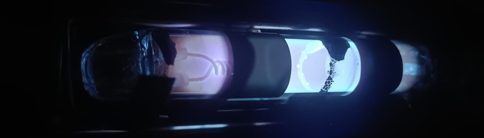

## Hi there my name is Miguel Apestegui👋
#### Physics undergraduate student

I'm an undergraduate **physics** student at Universitat Autònoma de Barcelona (UAB), currently studying my third year. I'm also a foundational member of  _Optica't_, a divulgational group of physical optics. In this GitHub account you'll find academic projects, personal projects and _Optica't_ projects. There are some examples of:

- 🎓 An academc project:
[Thermodynamics and Statistical Mechanics exercises](https://github.com/Efesic/TiME)

- ☀️ A personal project (WIP):
[Modelling and simulation of a Solar Panel](https://github.com/GallardoDodd/FvOptim)

- 💎 An _Optica't_ project (WIP):
[Introductory LaTeX course](https://github.com/Efesic/Curs-LateX)

Currently my projects are written in catalan or spanish, but I'm working for tranlate the most relevant ones ☺️. In these projects I use basically three languages:

- Python - To do calculations, data analysis and plots.
- LaTeX - To make reports and any kind of documents on pdf.
- Fortran - To do more complex an optimal calculations and some simulations.
